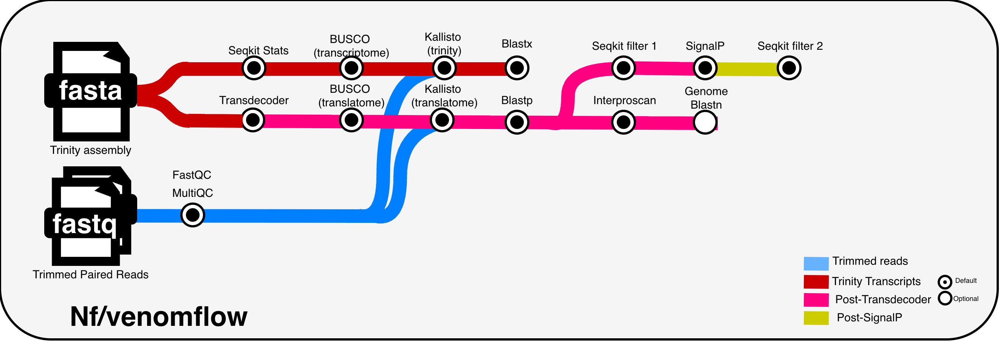
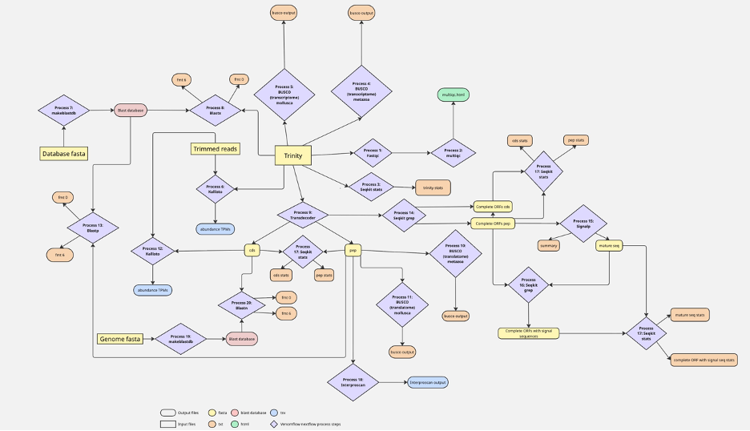

# Overview
___

## Quick Start:   

**1.** Install [Transdecoder](https://github.com/TransDecoder/TransDecoder/wiki), [BUSCO](https://busco.ezlab.org/busco_userguide.html), [SignalP](https://services.healthtech.dtu.dk/services/SignalP-5.0/)and [Interproscan](https://www.ebi.ac.uk/interpro/about/interproscan/) accordingly  
**2.** Download nextflow.config file from lexatrash-vf-092025  
**3.** Edit config file by providing appropriate input for each described parameter. config file must be in the same directory that the script is run from  
**4.** (Optional)Edit config file by providing appropriate memory allocation for each described parameters  
**5.** run on command line:  
    ``` nextflow pull lexatrash23/Nf-vf-pn-092025 ```  
**6.** run on command line (or preferably in an sbatch script) :  
   ``` nextflow run lexatrash23/Nf-vf-pn-092025 -with-conda -with-dag -with-timeline -with-report -with-trace  ```
___
## Additional notes 
**_Suggested Dir Structure:_**  
Sample_Name>Venomflow>.config  

**_BUSCO lineage files_:**  
If you are not using the molluscan and metazoan databases, you may still paste the path of any two lineages in the params listed under '// Path to BUSCO lineages files' in the config file but do not change the names of the params themselves. i.e. anything before the '=' in the config file should not be changed. 

**_When complete:_**     
Check slurm output file (if using sbatch script) to ensure all tasks were run successfully. Blast and Interproscan tasks may fail with insufficient memory allocation. If completed sucessfully, work directory can be deleted to clear space.

**_Rerunning and Rerunning after cancellation:_**  
-If desired -resume flag can be used to resume nextflow script when troubleshooting failed steps to avoid repeating successful steps  
-If slurm job running nextflow pipeline is cancelled prior to completion, and subsequent run fails, work directory may need to be deleted prior to rerunning to ensure proper conda environment installation 
___
Pipeline image : 


___
## Files
### Required Inputs
This Nextflow pipeline has 4 required input files and 1 optional input file. The required input files are as follows:
1. De novo Trinity Assembly (fasta)
2. Trimmed Reads R1 (fasta/fastq.gz)
3. Trimmed Reads R2 (fasta/fastq.gz)
4. Protein Sequences of interest to BLAST against (fasta)

### Optional Input
5. Genome fasta

### Provided test files
Config file is set up to run with the following default files:  
1. DP3_PD_test: A subset(200 sequences) of the trinity assembly from a Doryteuthis pealeii Posterior Salivary Gland tissue
2. R1_test: A subset(100 sequences) of the trimmed reads from the same sample
3. R2_test: A subset(100 sequences) of the trimmed reads from the same sample
4. unitox_fasta: Fasta file of ToxProt reviewed sequences [Accessed in August 2025]  

### Output files
All Output files can be found in the results subfolder of the directory the script was run from.  
Output files available are as follows: 
1. Fastqc  
	a. multiqc.html  
3. BUSCO  
	a. 4 Busco summary files (2 per lineage db used, one with the transcriptome and one translatome)  
5. Blast   
	a. blastx fmt 0 and 6   
 	b. blastp fmt 0 and 6  
  c. blastn fmt 0 and 6 (if genome was provided)  
6. kallisto  
	a. abundance.tsv files with trinity fasta used as an index  
	b. abundance.tsv files with transdecoder fasta used as an index  
8. Interproscan  
	a. Interproscan output file (tsv)  
10. Signalp  
	a. Signalp summary file and mature fasta  
12. Transdecoder  
	a. Transdecoder pep and cds files  
	b. Transdecoder pep and cds files filtered only for complete ORFs  
	c. Transdecoder pep file filtered only for those with signalp sequence predicted  
14. Stats  
	d. 9 Seqkit stats files  

___

## Next Step: lexatrash23/Nf-vfa-pn-092025 pipeline
To utilize the outputs from this pipeline in the Nextflow Venomflow analysis pipeline, add the path to the results file of this pipeline into the 'data' parameter of the config file for the venomflow analysis pipeline. More information about the analysis pipeline can be found [here](https://github.com/lexatrash23/Nf-vfa-pn-092025)

___
## Citing
This pipeline can be cited as follows:

[in preparation]

Achrak E, Ferd J, Schulman J, Dang T, Krampis K, Holford M. VenomFlow: An Automated Bioinformatic Pipeline for Identification of Disulfide-Rich Peptides from Venom Arsenals. Methods Mol Biol. 2022;2498:89-97. doi: 10.1007/978-1-0716-2313-8_6. PMID: 35727542.

Please also include citations for the individual bioinformatic tools utilized in this pipeline including: [fastqc](https://github.com/s-andrews/FastQC), [multiqc](https://github.com/MultiQC/MultiQC), [seqkit](https://bioinf.shenwei.me/seqkit/), BUSCO, [Kallisto](https://github.com/pachterlab/kallisto), [BLAST](https://support.nlm.nih.gov/kbArticle/?pn=KA-03391), [Transdecoder](https://github.com/TransDecoder/TransDecoder/wiki), [BUSCO](https://busco.ezlab.org/busco_userguide.html), [SignalP](https://services.healthtech.dtu.dk/services/SignalP-5.0/)and [Interproscan](https://www.ebi.ac.uk/interpro/about/interproscan/) 
___
## Pipeline development and Contact information

This Nextflow pipeline was developed by [the Holford Lab](https://holfordlab.com/) by [Praveena Naidu](https://github.com/lexatrash23) and is based on the [Venomflow](https://pubmed.ncbi.nlm.nih.gov/35727542/) pipeline previously developed in the Holford Lab by Eleonora Achrak [OCRID profile hyperlink].The code for this Nextflow pipeline has been reviewed by [Add Name/hyperlinks of individuals or bioinformatics teams that have reviewed this code]. The Holford Lab can be contacted at holfordlab@gmail.com.
___
