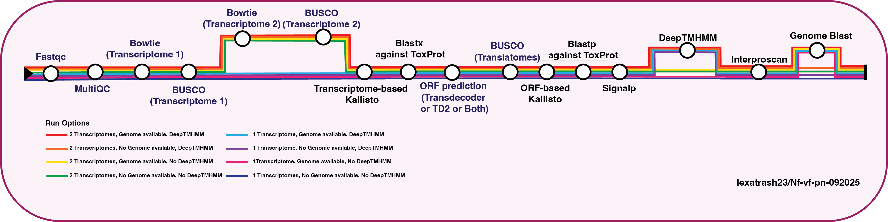
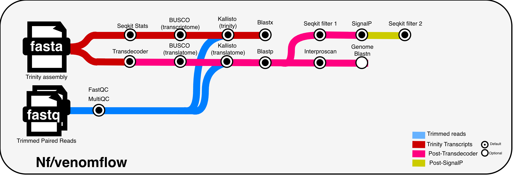

This Nextflow pipeline and documentation is still in development! 
___
# Overview
Venomflow is an automated Nextflow-based pipeline for the identification of venom peptides and proteins from transcriptomic data. 

The pipeline involves quality assessment(Fastqc, BUSCO, Bowtie), BLAST (against ToxProt, NonToxProt and Genome database if available), ORF prediction(Transdecoder, TD2), Signal Sequence Prediction (Signalp5, DeepTMHMM), Expression quantification(Kallisto), Domain annotation (Interproscan).

The Output of this pipeline can be used as an input for the Venomflow-analysis pipeline [here](https://github.com/lexatrash23/Nf-vfa-pn-092025)
___

___
## Inputs and Outputs 
### Required Input files
This Nextflow pipeline has 4 required input files and 2 optional input file per sample (per row in the Samplesheet.csv). The required input files are as follows:
1. Transcriptome Assembly (fasta)
2. Trimmed Reads R1 (fasta/fastq.gz)
3. Trimmed Reads R2 (fasta/fastq.gz)
4. ToxProt UniProt reviewed proteins (fasta)
5. NonToxProt UniProt reviewed proteins (fasta)

### Optional Input files 
5. Genome fasta
6. A second transcriptome assembly 

## Optional Run Parameters 
-profile     conda; singularity 
</br>
-- DeepTMHMM false;true
</br>
-- ORFPrediction TD2;TD;Both
</br>
## Output files
All Output files can be found in within the sample name-derived folder in the directory the script was run from.  
Output files available are as follows: 
1. Fastqc  
    a. multiqc.html 
2. BUSCO  
    a. Transcriptome : BUSCO summary files, 1 per lineage specified per transcriptome provided. 
   </br>
    b. Translatome: BUSCO summary files, 1 per lineage.
3. Blast
    a. blastx fmt 0 and 6   
     b. blastp fmt 0 and 6  
  c. blastn fmt 0 and 6 (if genome was provided)

4. kallisto  
    a. abundance.tsv files with trinity fasta used as an index  
    b. abundance.tsv files with transdecoder fasta used as an index

5. Interproscan  
    a. Interproscan output file (tsv)

6. Signalp  
    a. Signalp summary file and mature fasta

7. ORF Prediction  
    a. Transdecoder/TD2 pep and cds files  
    b. Transdecoder/TD2 pep and cds files filtered only for complete ORFs  
    c. Transdecoder/TD2 pep file filtered only for those with signalp sequence predicted

8. Stats  
    d. 9 Seqkit stats files  

## Pre-requisites
### Nextflow 
Nextflow requires Bash 3.2 (or later) and Java 17 (or later, up to 25) to be installed.Detailed information on nextflow installation can be found [here](https://www.nextflow.io/docs/latest/install.html)
> Install SDKMAN:
    ``` curl -s https://get.sdkman.io | bash ```

<br>

> Install Java: 
    ``` sdk install java 17.0.10-tem ```

<br>

> Install nextflow: 
    ``` curl -s https://get.nextflow.io | bash ```
<br>

> Make nextflow executable and move into an executable path:
    ``` chmod +x nextflow 
        mkdir -p $HOME/.local/bin/
        mv nextflow $HOME/.local/bin/
    ```

<br>

> Confirm nextflow installation 
 ``` nextflow info ```

<br>
 
### SignalP 5.0 
Information for SignalP 5.0 download and installation can be found [here](https://services.healthtech.dtu.dk/services/SignalP-5.0/)
> Download SignalP 5.0b 
 Download Linux version of SignalP 5.0 from above hyperlink
> Extract SignalP 5.0 
 Move SignalP 5.0 package into desired directory and extract: 
 ``` tar -xvzf signalp-5.0b.Linux.tar.gz
 ```
> Make signalp executable:
open bashrc:  
``` nano ~/.bashrc ``` 
add the following line to the bashrc file replace [PathToFile] with the path to signalp-5.0b in your directory: 
export PATH=$PATH:[PathToFile]/signalp-5.0b/bin/

### Interproscan 
Information for Interproscan download and installation can be found [here](https://www.ebi.ac.uk/interpro/download/InterProScan/)
> Installation:
Install Interproscan 5 from the above link 
> Make Interproscan executable:
move interprscan download to the desired directory
open bashrc:  
``` nano ~/.bashrc ``` 
add the following line to the bashrc file replace [PathToFile] with the path to Interproscan dir in your directory: 
export PATH=$PATH:[PathToFile]interproscan-5.76-107.0/

### Database fasta file for Blastx and Blastn 
The Animal toxin annotation project homepage can be found [here]( https://www.uniprot.org/help/Toxins)
Here you can download your desired venom fasta file that will be used as database against which to search for similar venom proteins. A version of this file accessed in August 2025 can be found in this github homepage in the Test_files dir with the name "Unitox_curated.fasta"
### Genome fasta (optional)
If your sample organism has an available genome, you may include the path to this genome fasta file in the SampleSheet.csv 

## Filing up the Sample Sheet 
**1.** Download SampleSheet.csv file from this Github page 
This Samplesheet.csv is utilized for both the VenomFlow pipeline as well as for VenomflowAnalysis pipeline that can be run following this pipeline. More information on the VenomflowAnalysis pipeline can be found here.
This Samplesheet.csv contains both Metadata and file path columns. Most metadata columns will be used for the VenomFlowAnalysis pipeline and can be ignored for this pipeline. 
For Venomflow pipeline running there are 11 mandatory columns and 5 optional columns as follows: 
| # | Column name | Mandatory/Optional | Expected Input description | Expected Input example | Input Format |
|---|-------------|--------------------|----------------------------|------------------------|-------------|
| 1 | Sample_name | Mandatory | A shorthand for the sample name that will be used as a prefix in output files as well for the name of the results folder | "DP3_PD" | String |
| 2 | R1 | Mandatory | Trimmed Reads 1 | "/home/project/lexatrash/DP3/TrimmedReads/R1.fastq.gz" | Path to fasta/fastq/fastq.gz |
| 3 | R2 | Mandatory | Trimmed Reads 2 | "/home/project/lexatrash/DP3/TrimmedReads/R2.fastq.gz" | Path to fasta/fastq/fastq.gz |
| 4 | Strandedness | Mandatory | Strandedness information. "rf" = Reverse, "fr" = Forward. "Unstranded" = Unstranded. Any input other than rf or fr will also be taken as unstranded | "rf" | String |
| 5 | Transcriptome1_label | Mandatory | Label for transcriptome assembly. Will be used as a prefix for transcript sequences if more than one transcriptome assembly is provided | "DN" | String |
| 6 | Transcriptome1 | Mandatory | Path to Transcriptome assembly | "/home/project/lexatrash/DP3/Trinity/Trinity.fasta" | Path to fasta file |
| 7 | Transcriptome2_label | Optional | Label for 2nd transcriptome assembly if available. Will be used as a prefix for transcript sequences | "GB" | String |
| 8 | Transcriptome2 | Optional | Path to Transcriptome2 assembly | "/home/project/lexatrash/DP3/Stringtie/Stringtie.fasta" | Path to fasta file |
| 9 | BUSCO_lin1 | Mandatory | Desired BUSCO lineage for transcriptome and translatome assessments. Complete BUSCO lineage options can be found here | "metazoa_odb10" | String |
| 10 | BUSCO_lin2 | Mandatory | Desired second BUSCO lineage for transcriptome and translatome assessments. Complete BUSCO lineage options can be found here | "mollusca_odb10" | String |
| 11 | Protein_fasta_path_for_Blast | Mandatory | Path to fasta file intended to be used as blast database | "/home/project/lexatrash/Databases/Unitox_curated.fasta" | Path to fasta file |
| 12 | Protein_fasta_name | Mandatory | String name for Blast Database | "Unitox_curated" | String |
| 13 | isgenomeavailble | Mandatory | "Y" = Genome fasta is available, "N" = No genome fasta is available | "Y" | String |
| 14 | Genome_fasta_path | Optional | Path to genome fasta if available | "/home/project/lexatrash/Genomes/Dp.fasta" | Path to fasta/fasta.gz |
| 15 | NCBI_Genome_id | Optional | NCBI genome accession ID if available | "GCA_023376005.1" | String |

## Quick Start:   

**1.** Install [BUSCO](https://busco.ezlab.org/busco_userguide.html), [SignalP](https://services.healthtech.dtu.dk/services/SignalP-5.0/) and [Interproscan](https://www.ebi.ac.uk/interpro/about/interproscan/) accordingly  - insert hyperlink to section below on how to install each of these and add to PATH.

___
## Additional notes 
**_Suggested Dir Structure:_**  
Sample_Name>Venomflow>.config  

**_BUSCO lineage files_:**  
If you are not using the molluscan and metazoan databases, you may still paste the path of any two lineages in the params listed under '// Path to BUSCO lineages files' in the config file but do not change the names of the params themselves. i.e. anything before the '=' in the config file should not be changed. 

**_When complete:_**     
Check slurm output file (if using sbatch script) to ensure all tasks were run successfully. Blast and Interproscan tasks may fail with insufficient memory allocation. If completed sucessfully, work directory can be deleted to clear space.

**_Rerunning and Rerunning after cancellation:_**  
-If desired -resume flag can be used to resume nextflow script when troubleshooting failed steps to avoid repeating successful steps  
-If slurm job running nextflow pipeline is cancelled prior to completion, and subsequent run fails, work directory may need to be deleted prior to rerunning to ensure proper conda environment installation 
___
Pipeline image : 


___


### Provided test files
Test run can be down with the following provided test files:  
1. trinity_test: A subset(200 sequences) of the trinity assembly from a Doryteuthis pealeii Posterior Salivary Gland tissue
2. left_test: A subset(200 sequences) of the trimmed reads from the same sample
3. right_test: A subset(200 sequences) of the trimmed reads from the same sample
4. unitox_fasta: Fasta file of ToxProt reviewed sequences [Accessed in August 2025]  
Download Test_files folder and specify respective file paths in local config file.
Due to size limitations, these are only sample fasta and hence the results will be limited  


___

## Next Step: lexatrash23/Nf-vfa-pn-092025 pipeline
To utilize the outputs from this pipeline in the Nextflow Venomflow analysis pipeline, add the path to the results file of this pipeline into the 'data' parameter of the config file for the venomflow analysis pipeline. More information about the analysis pipeline can be found [here](https://github.com/lexatrash23/Nf-vfa-pn-092025)

___
## Citing
This pipeline can be cited as follows:

[in preparation]

Achrak E, Ferd J, Schulman J, Dang T, Krampis K, Holford M. VenomFlow: An Automated Bioinformatic Pipeline for Identification of Disulfide-Rich Peptides from Venom Arsenals. Methods Mol Biol. 2022;2498:89-97. doi: 10.1007/978-1-0716-2313-8_6. PMID: 35727542.

Please also include citations for the individual bioinformatic tools utilized in this pipeline including: [fastqc](https://github.com/s-andrews/FastQC), [multiqc](https://github.com/MultiQC/MultiQC), [seqkit](https://bioinf.shenwei.me/seqkit/), [Kallisto](https://github.com/pachterlab/kallisto), [BLAST](https://support.nlm.nih.gov/kbArticle/?pn=KA-03391), [Transdecoder](https://github.com/TransDecoder/TransDecoder/wiki), [BUSCO](https://busco.ezlab.org/busco_userguide.html), [SignalP](https://services.healthtech.dtu.dk/services/SignalP-5.0/)and [Interproscan](https://www.ebi.ac.uk/interpro/about/interproscan/) 
___
## Pipeline development and Contact information

This Nextflow pipeline was developed by [the Holford Lab](https://holfordlab.com/) by [Praveena Naidu](https://github.com/lexatrash23) and is based on the [Venomflow](https://pubmed.ncbi.nlm.nih.gov/35727542/) pipeline previously developed in the Holford Lab by Eleonora Achrak [OCRID profile hyperlink].The code for this Nextflow pipeline has been reviewed by [Add Name/hyperlinks of individuals or bioinformatics teams that have reviewed this code]. The Holford Lab can be contacted at holfordlab@gmail.com.
___
